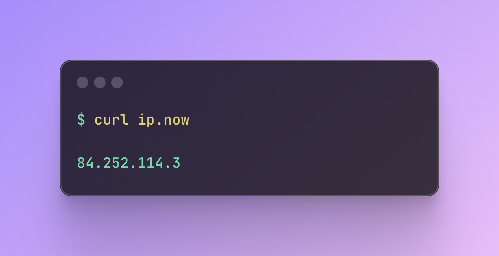
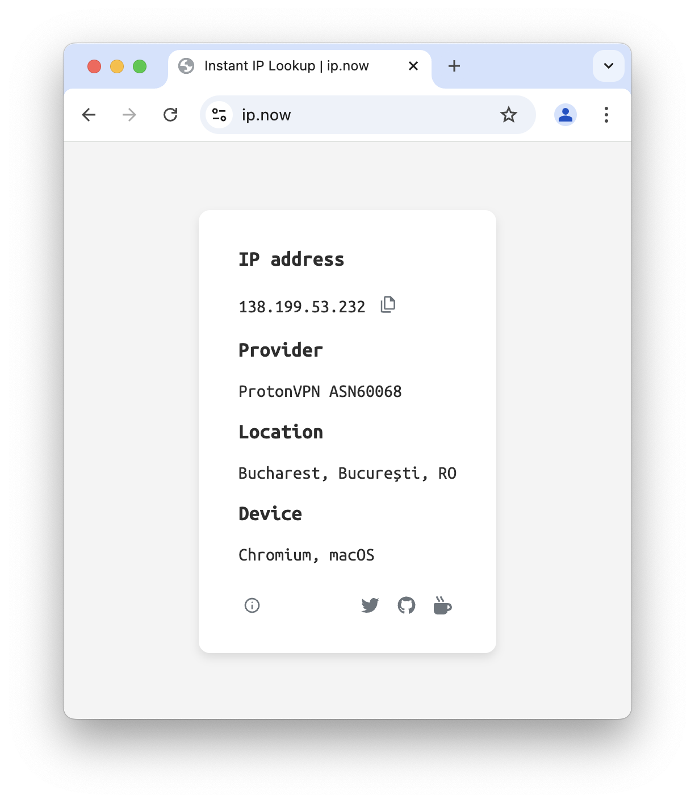
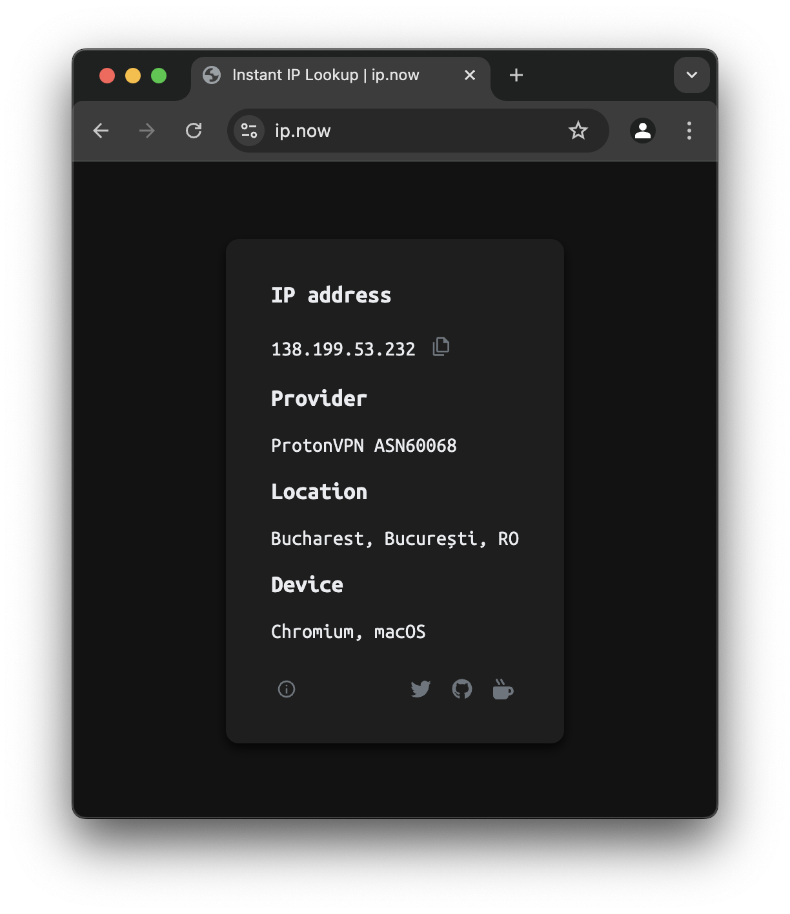
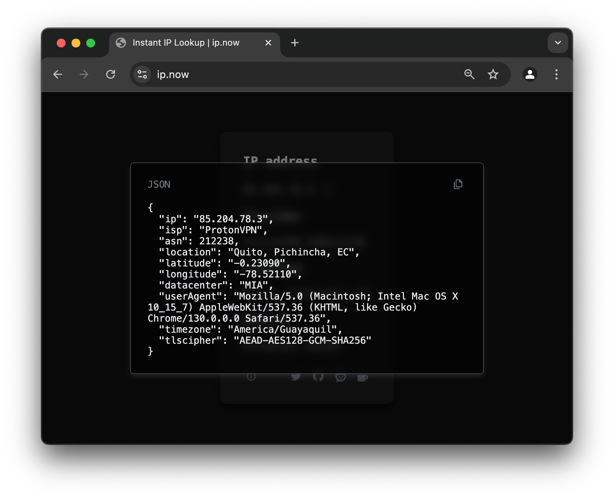

[](https://status.ip.now/)

# ip.now

I needed an excuse to tinker with Cloudflare Workers, and for whatever reason this was it.

So there you have it, yet *another* "What is my IP" site.

:white_check_mark: Instant access with `curl ip.now`

:white_check_mark: Copy to clipboard

:white_check_mark: Provider, location & device info

:white_check_mark: /details endpoint for JSON output with more advanced details

:white_check_mark: NEW: WHOIS support - get instant information about any IP address or domain name

## WHOIS Support

Just added WHOIS support! So you can now quickly find information about an IP address or domain name too, instead of only being able to find your own IP.

## Usage - find your IP

**Browser**:

Simply head over to [ip.now](https://ip.now) to see your IP, click or tap the IP address to copy to clipboard.

**Terminal**:

Using [ip.now](https://ip.now) from a terminal is easy:

```
curl ip.now
```

Options to copy to clipboard from terminal may vary based on your system. Here are some examples to get you started:

In MacOS, open a terminal and do:

```
curl ip.now | pbcopy
```

In Linux:

Many ways available but I like `xclip`. Make sure that is installed, then:

```
curl ip.now | xclip -selection clipboard
```

Windows:

Open PowerShell and do:

```
curl ip.now | Set-Clipboard
```
With that, you instantly have your public IP address copied to clipboard.

You can do the same with the /details endpoint to get more info:

```
curl ip.now/details
```

## Usage - query any IP or domain

Instantly get information about any IP address or domain name:

`curl ip.now/1.1.1.1` 

or:

`curl ip.now/google.com`

See our screenshots below and give it all a try!

## Screenshots

<div align="center">
	
	
</div>

<div align="center">
	
	  
</div>

<div align="center">
	
	  
</div>

# Support & Communities

Provide feedback or submit feature requests on our subreddit!

Follow me on Twitter, support me right here on GitHub, or Buy Me a Coffee!

Any and all support is deeply appreciated:

<div align="center">

[](https://twitter.com/gomarcd)
&nbsp;&nbsp;&nbsp;&nbsp;
[](https://www.reddit.com/r/ipnow/)
&nbsp;&nbsp;&nbsp;&nbsp;
[](https://github.com/sponsors/gomarcd)
&nbsp;&nbsp;&nbsp;&nbsp;
[](https://www.buymeacoffee.com/gomarcd)
&nbsp;&nbsp;&nbsp;&nbsp;
</div>
